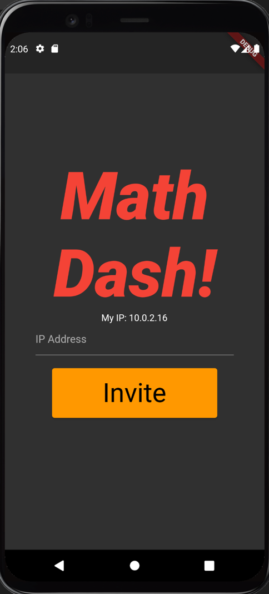
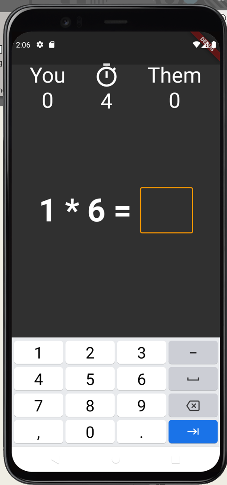
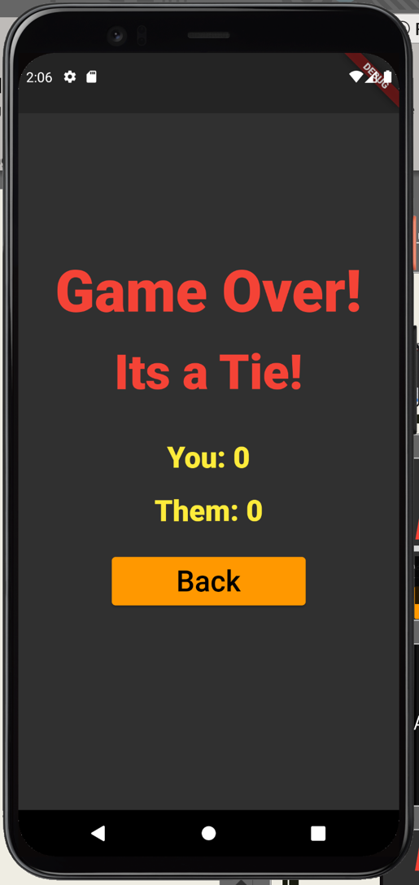
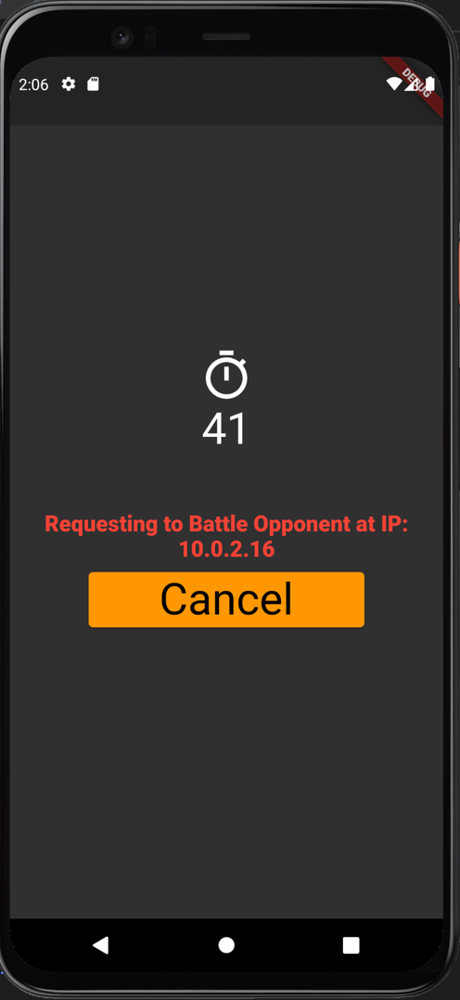
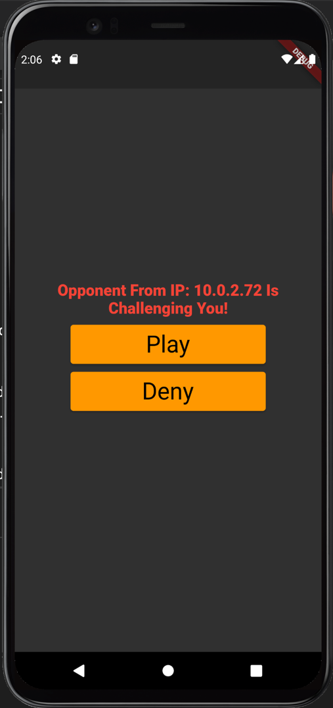

# MathDash

## An App by Isaac Khounborine, Josh Thomeczek, and Simon Reid

### Description
Math Dash is a multiplayer game in which two players are given the same set of math problems to see who can solve more problems in the alloted time. This app features a local IP invite system so that you can play against other players on the same WiFi network.

### Gameplay Images

### Invite System Images

### Known Issues
This app has been difficult to test, since testing networking requires multiple devices to run debug builds of the app and work on the same WiFi network. Since the Android emulator runs in a virtual WiFi connection (AndroidWiFi), we were unable to test internet connectivity. Currently, the app can theoretically send invites and responses, but a game will not commence and the scores will not be updated. These issues should be fixed soon, and we apologize for the inconvenience.
